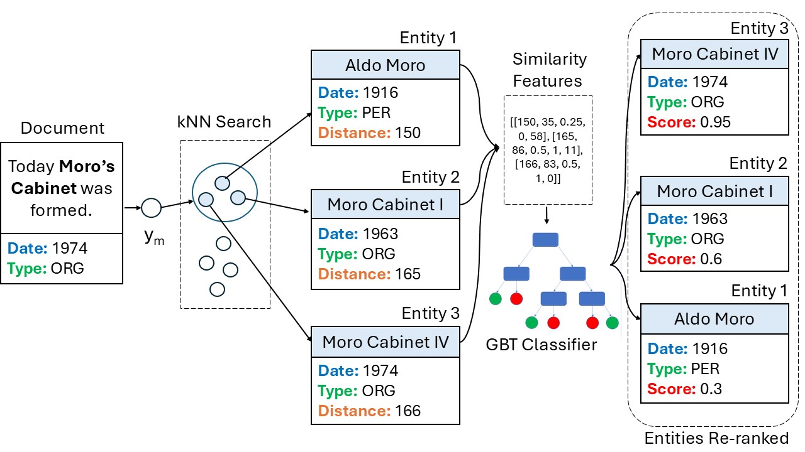

# DELICATE: Diachronic Entity LInking using Classes And Temporal Evidence

This repository contains the software used for implementing and testing DELICATE, an Entity Linking system trained on historical documents in Italian, designed for being more sensitive to the context of provenance of a document than general-purpose Entity Linking models. An image of the DELICATE architecture is available below:



For the implementation of the candidate retrieval component, DELICATE relies on the [BLINK](https://github.com/facebookresearch/BLINK) library from Facebook.

## Setup Environment 


Since this software uses an old version of FAISS, Python=3.9 is recommended.

```
conda create -n delicate -y python=3.9 && conda activate delicate
pip install -r requirements.txt
```

### Download Pre-trained Models

Download the pre-trained models from Hugging Face and place them in the `DELICATE_models/` directory:

```bash
# Install huggingface-cli if not already installed
pip install -U huggingface_hub

# Download models
hf download sntcristian/DELICATE_models --local-dir DELICATE_models

```
This will create the correct directory structure:

```
DELICATE/
├── DELICATE_models/

```
## DELICATE Tutorial Notebook

A demo of the different functionalities of DELICATE is available in a [Jupyter Notebook](./tutorial_delicate.ipynb).


## Use DELICATE for Inference

To use the DELICATE pipeline on a specific input it is possible to use the following command: 
```
python pipeline.py --config_file "configs/config_all.json" --output_dir "./test" --publication_date "1826" --text "Il poeta di Recanati Giacomo Leopardi scrisse le Operette Morali." 
```


## Train Candidate Reranker

DELICATE pairs BLINK with a GBT candidate re-ranker mechanism trained on [ENEIDE](https://github.com/sntcristian/ENEIDE). To train the reranker from scratch, you can run:

Example:
```
python train.py --dataset_path "../ENEIDE/v1.0/DZ/" --models_dir "./DELICATE_models" --block_size 50 --negatives 10 --output_dir "./"
```

## Test DELICATE on ENEIDE 

Example:
```
python run_delicate.py --documents ""../ENEIDE/v1.0/DZ/paragraphs_test.csv" --annotations ""../ENEIDE/v1.0/DZ/annotations_test.csv" --config "configs/config_all.json" ...
```
