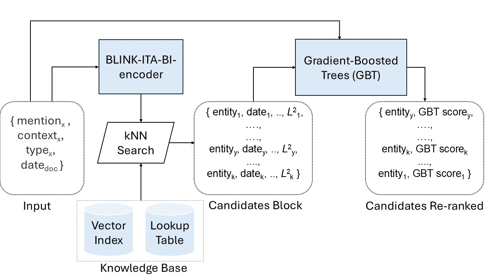

# ELITE: Entity Linking in Italian for long-Tail Entities

This repository contains the software used for implementing and testing ELITE. ELITE is an Entity Linking system trained on humanistic documents in Italian, designed for being more sensitive to the context of provenance of a document than general-purpose Entity Linking models. An image of the ELITE architecture is available below:



For the implementation of the candidate retrieval component, ELITE relies on the [BLINK](https://github.com/facebookresearch/BLINK) library from Facebook.

## Setup Environment


Since this software uses an old version of FAISS, Python=3.9 is recommended.

```
conda create -n elite -y python=3.9 && conda activate elite
pip install -r requirements.txt
```


## ELITE Tutorial Notebook

A demo of the different functionalities of ELITE is available in a [Jupyter Notebook](./tutorial_elite.ipynb).


## Use ELITE for Inference

To use the ELITE pipeline on a specific input it is possible to use the following command: 
```
python pipeline.py --config_file "configs/config_dz.json" --output_dir "./test" --publication_date "1826" --text "Il poeta di Recanati Giacomo Leopardi scrisse le Operette Morali." 
```

## Train NER Model

Example:
```
python train_NER.py --dataset_path "../ENEIDE/DZ/v0.1/json_data" --output_dir "ner_model"
```


## Train Candidate Reranker

Example:
```
python train.py --dataset_path "../ENEIDE/DZ/v0.1/" --models_dir "./ELITE_models" --block_size 50 --negatives 10 --output_dir "./"
```

## Run ELITE on ENEIDE Dataset

Example:
```
python run_elite.py --documents "paragraphs_test.csv" --annotations "annotations_test.csv" --config "configs/config_amd.json" ...
```

### 2. Download Pre-trained Models

Trained models and dataset will be available soon!